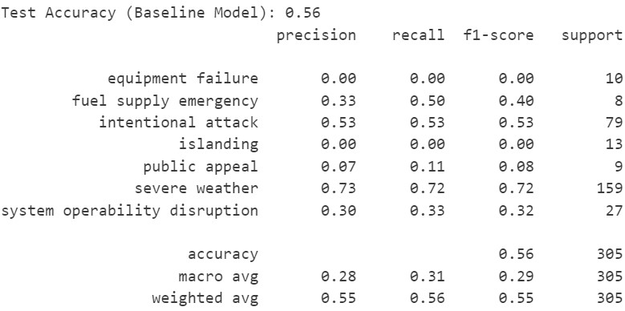

# Investigating Power Outages Associated with Causes
by Max Yuen Sum Wong(y6wong@ucsd.edu), Chris Yuen Kei Wong(ykw001@ucsd.edu)

--- 

## Project Overview
This project will condcut an open-ended investigation into the dataset of the power outages dataset, then we will discussing a question with training a new model and compare with the original one in order to conduct some interesting analysis.

## Framing the Problem 
Based on the investigation we concluded on the previous investigation, we would like to predict the number and severity of major power outages in the year 2024, which the dataset only contains the major power outage data in the continental U.S. from January 2000 to July 2016. And we would like to discuss the porblem in predicting the cause of a High Serverrity power outage.

Predicting the cause of a major power outage is crucial for efficient response. Power outages have significant impacts on various sectors, disrupting critical services, industries, and daily life. Understanding the cause of a high-severity power outage allows for targeted preventive measures, such as infrastructure upgrades or maintenance, reducing the likelihood and duration of future disruptions. This proactive approach enhances overall grid reliability, minimizes economic losses, and ensures a more resilient and stable power supply.

To make accurate predictions, we are using the dataset on 1534 power outages cases from 200 to 2016, with 59 columns recording the information. Based one the question we investigate, this dataset includes various features such as the `'YEAR'`, `'CLIMATE.CATEGORY'`, `'OUTAGE.START'`, `'OUTAGE.RESTORATION'`, `'OUTAGE.DURATION'`, `'CAUSE.CATEGORY'`, `'DEMAND.LOSS.MW'`, `'CUSTOMERS.AFFECTED'`, `'TOTAL.CUSTOMERS'`, `'HIGH_SEVERITY'`, and the list goes on.

By training a classification model usingthe data, we aim to complete a model that increase the accuracy in identify what the distribution of cause of mojor power outages in the following years. Training a classification model contributes to improved decision-making by enabling automated categorization of data, leading to more efficient and accurate predictions. In the future, this can enhance various fields such as healthcare, finance, and technology, fostering innovation, and streamlining processes for better outcomes and resource optimization. Finally, we wouldn't consider the time prediction in our model. 

## About the data cleaning 
We would use the same data cleaning we did in the previous analysis, which can be found [here](https://kwkkei.github.io/power_outage_investigation/). 

In order to increase the readability and accuracy of our data, we have commit some changes to clean the original DataFrame we get. 

1. **Create a function to combine the `'OUTAGE.START.DATE'` and `'OUTAGE.START.TIME'` into a new column named `'OUTAGE.START'` where store the datetime value of the outage starting time. Doing the same as the `'OUTAGE.RESTORATION'` column in the `'cleaned'` dataset.**
2. **Defining the `'HIGH_SEVERITY'` column where it stores the boolean values whether the `'OUTAGE.DURATION'` is greater than the high_severity_threshold which we define as the mean of `'OUTAGE.DURATION'`.**

After data cleaning, the first 5 rows of the data in the new DataFrame called `'cleaned'` would be showing, moreover, we have added new columns for the data cleaning part. See as follow:

|   YEAR | CLIMATE.CATEGORY   | OUTAGE.START        | OUTAGE.RESTORATION   |   OUTAGE.DURATION | CAUSE.CATEGORY     | CAUSE.CATEGORY.DETAIL   |   DEMAND.LOSS.MW |   CUSTOMERS.AFFECTED |   TOTAL.CUSTOMERS | HIGH_SEVERITY   |
|-------:|:-------------------|:--------------------|:---------------------|------------------:|:-------------------|:------------------------|-----------------:|---------------------:|------------------:|:----------------|
|   2011 | normal             | 2011-07-01 17:00:00 | 2011-07-03 20:00:00  |              3060 | severe weather     | nan                     |              nan |                70000 |           2595696 | True            |
|   2011 | normal             | 2011-07-08 10:00:00 | 2011-07-08 10:00:00  |                 0 | intentional attack | vandalism               |                0 |                    0 |           2595696 | False           |
|   2011 | normal             | 2011-05-11 15:55:00 | 2011-05-12 13:57:00  |              1322 | intentional attack | vandalism               |                0 |                    0 |           2595696 | False           |
|   2011 | cold               | 2011-04-19 22:44:00 | 2011-04-20 02:00:00  |               196 | severe weather     | nan                     |              100 |                64000 |           3174123 | False           |
|   2011 | normal             | 2011-06-22 09:46:00 | 2011-06-22 09:46:00  |                 0 | severe weather     | nan                     |              nan |               106300 |           3174123 | False           |

(This part is copied from the previous Project)

## Prediction Probem: Classification

In the context of predicting the cause of major power outages, training a classification model on the provided dataset is essential for identifying patterns and trends in outage causes. This predictive model can contribute to proactive decision-making by enabling the timely implementation of targeted preventive measures, such as infrastructure upgrades or maintenance, thereby reducing the likelihood and impact of high-severity power outages in the future. 

## Response Variable 

The response variable in the classification model is the `'CAUSE.CATEGORY'`, representing the cause category of major power outages. This variable is crucial for the model to learn and predict the specific factors leading to power disruptions.

## Features

Two selected features for the classification model are `'YEAR'` and `'DEMAND.LOSS.MW'`. `'YEAR'` provides temporal information, while `'DEMAND.LOSS.MW'` represents the demand loss in megawatts during an outage. These features aim to capture both temporal and demand-related aspects that may influence the cause of power outages.

## Metric for Evaluation 

The chosen metric for model evaluation is accuracy, as it measures the proportion of correctly predicted cause categories among all predictions. Given the multi-class classification nature of predicting outage causes, accuracy provides a straightforward and interpretable measure of overall model performance.

## Justification for Metric Choice

Accuracy is justified as the primary evaluation metric because it directly aligns with the goal of correctly classifying the causes of power outages. Given the importance of accurate predictions for informing preventive measures, a high accuracy score indicates the model's effectiveness in identifying the underlying patterns and trends in the data. However, it is essential to consider potential class imbalances and explore additional metrics, such as precision, recall, and F-1 score, to ensure a comprehensive understanding of the model's performance.

---

## Baseline Model
### Model Description

The baseline model utilizes a RandomForestClassifier to predict the `'CAUSE.CATEGORY'` of major power outages based on selected features, including only `'OUTAGE.DURATION'`, and `'CLIMATE.CATEGORY'`. The model employs preprocessing techniques such as imputation of missing values, scaling numerical features, and one-hot encoding categorical features.

### Encoding 

For encoding, the model applies one-hot encoding to the categorical feature `'HIGH_SEVERITY'`, transforming it into binary values. This encoding allows the model to interpret and incorporate this binary feature effectively in its predictions. The preprocessing steps aim to standardize and prepare the data for the RandomForestClassifier.

### Model Performance

The model achieved a test accuracy of 56%. The classification report provides additional insights into precision, recall, and F1-score for each cause category, indicating variable performance across different classes. The confusion matrix visualizes the model's predictions against the actual values, highlighting areas of correct and incorrect classification.

The model, that is shown in a form of confusion matrix, is showing the distribution of the cause category in major power outage as below:

### Summary

The baseline model, utilizing a RandomForestClassifier, was trained on a set of features encompassing temporal, climatic, and demand-related aspects to predict the cause categories of major power outages. Despite achieving a test accuracy of 56%, the model's performance varies across different cause categories, as indicated by the classification report. Notably, some categories, such as "severe weather," exhibit higher precision and recall, while others, like "equipment failure," struggle to be accurately predicted.

#### Model Evaluation:

The confusion matrix visualizes the model's predictions, illustrating areas of both correct and incorrect classifications. The model tends to misclassify certain cause categories, evident in the off-diagonal elements of the matrix. Understanding these misclassifications is crucial for refining the model and improving its predictive capabilities.

#### Improvements and Additional Steps:

According to the accuracy of the training test, it seems it is too low since there are too few features are taken into account. To enhance the model's performance, several steps can be taken. Feature engineering may involve extracting more meaningful information from existing features or introducing new features that better capture the underlying patterns in the data. Hyperparameter tuning allows for optimizing the model's configuration to find the most effective parameters, potentially improving predictive accuracy which we will do in our final model.

#### Handling Class Imbalance:

Given the varying support across different cause categories, addressing class imbalance is crucial. Techniques such as oversampling minority classes or undersampling majority classes can be employed to create a more balanced training set. This can prevent the model from being biased towards predicting the majority class and improve its ability to discern patterns in less frequent causes of power outages.

#### Incorporating Temporal and Spatial Context:

Considering the temporal and spatial aspects of power outages might provide valuable insights. Feature engineering could involve creating new features that capture the seasonality of outages, regional patterns, or temporal trends, contributing to a more nuanced understanding of the causes.

#### Advanced Model Architectures:

Exploring more sophisticated model architectures or ensemble methods beyond the baseline RandomForestClassifier might yield improvements. Techniques like gradient boosting or neural networks may capture complex relationships within the data, enhancing the model's predictive capabilities.

In summary, while the baseline model provides a foundation, further refinement through feature engineering, hyperparameter tuning, and addressing class imbalance is essential for creating a more accurate and robust predictive model for power outage cause classification.

---

## Final Model
### Model Choosing and Features:
The final model, aiming to predict the cause categories of major power outages, underwent significant improvements and fine-tuning. Unnecessary columns such as `'OUTAGE.START'` and `'OUTAGE.RESTORATION'` were dropped, and missing values were handled. This time we are going to add more features, and the chosen features include `'YEAR'`, `'OUTAGE.DURATION'`, `'CLIMATE.CATEGORY'`, `'DEMAND.LOSS.MW'`, `'CUSTOMERS.AFFECTED'`, `'TOTAL.CUSTOMERS'`, and `'HIGH_SEVERITY'`. Numeric features were scaled using StandardScaler, while categorical features underwent one-hot encoding.

### Model Performance
Hyperparameter tuning was performed using GridSearchCV, optimizing parameters such as 'n_estimators', 'max_depth', and 'min_samples_split' for the RandomForestClassifier. The best hyperparameters were found to be {'max_depth': 32, 'min_samples_split': 16, 'n_estimators': 12}. The final model achieved an accuracy of 78.42% on the test set, showcasing a substantial improvement over the baseline model. 

Compare to the confusion matrix using the baseline model, you can see the distribution of the causes didn't changed that much; however, the difference is to include more features so the regoression line is fitting up to higher the accuracy. 

### Summary
The final model, with its refined features and optimized hyperparameters, serves as a robust tool for predicting the causes of major power outages. It provides valuable insights for proactive decision-making, allowing stakeholders to implement targeted preventive measures and minimize the impact of power disruptions. Continuous efforts to refine and update the model will contribute to its long-term efficacy in addressing the dynamic nature of power outage causes. The final model demonstrates the significance of hyperparameter tuning and feature selection in enhancing predictive performance. Further improvements can be explored through additional feature engineering, considering temporal and spatial context, and addressing potential class imbalance. Continuous monitoring and periodic reevaluation of the model's performance are crucial to ensure its relevance and effectiveness over time.

---

## Fairness Analysis

### Introduction 
Fairness analysis is crucial to ensure that machine learning models do not exhibit disparitises across different groups. In this context, the analysis aims to evaluate the fairness of the model concerning power outage severity categories.

### Group Selection 
For the fairness analysis, two groups are considered:
- Group X: High Severity Major Power Outages 
- Group Y: Low Severity Major Power Outages

### Evaluation Metric 
The evaluation metric for fairness is the difference in model accuracy between Group X and Group Y.

### Null Hypothesis 
Null Hypothesis: The model is fair accuracy for high-severity major outages and low-severity major outages is approximately the same, and any differences observe are due to random chance. 

### Alternative Hypothesis
Alternative Hypothesis: The model is unfair. The accuracy for high-severity major outages is significantly different from the accuracy for low-severity major outages.

### Calculation of p-value

<iframe src="asset/p_graph.html" width=800 height=600 frameBorder=0></iframe>

A permutation test is conducted by shuffing the `'HIGH_SEVERITY'` column in the dataset and calculating the fairness metric for 1000 iterations. The p-value is then deteremined as the proportion of shuffled fairness metric. And the resulting p-value is 0.011.

### Conclusion
With a p-value of 0.011, which is smaller than the signigicance level of 0.05, there is sufficient evidence to reject the null hypothesis. Therefore, we do have significant statistical evidence to claim that the model is unfair with respect to power outage severity categories. Further monitoring and analysis may be necessary to ensure ongoing fairness as the mdoel is deployed in real-world scenarios. 
